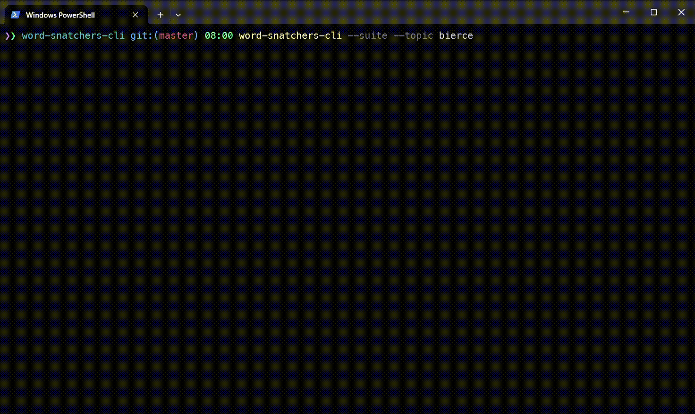

<div align="center">
  
</div>

# word-snatchers-cli [![NPM version][npm-image]][npm-url]

> A console game which target is unscramble the letters to spell out a word fitting the given definition.

## Installation

```sh
$ npm install --global word-snatchers-cli
```

or

```sh
$ yarn global add word-snatchers-cli
```

## Usage

Run a game with default set of questions:

```shell
$ word-snatchers-cli
```

or

```shell
$ wsc
```

or

```shell
$ words-game
```

## Demo



## Notes

You can provide another json file that contains question items by passing an appropriate option:

```shell
$ words-game --file my/custom/questions.json
```

In order to run several game rounds you can use the `--suite` flag:

```shell
$ words-game --suite
```

You can use specific topic for suite, for example:

```shell
$ words-game --suite --topic bierce
```

There is the `--suite-folder` flag to provide a folder to use another set of questions at once (rounds) from all json files located in a specified folder:

```shell
$ words-game --suite --suite-folder "C:\baz"
```

In order to run only specific round (from specified file) you can use the `--suite-item` option:

```shell
$ words-game --suite --suite-folder "C:\baz" --suite-item="first.json"
```

You can also omit the `.json` extension:

```shell
$ words-game --suite --suite-folder "C:\baz" --suite-item="first"
```

Use a plugin by providing the `--plugin` option:

```shell
$ words-game --plugin word-snatchers-cli-fruits-plugin
```

If a plugin has several rounds you can run a specified round by using the `--round-number` option:

```shell
$ words-game --plugin word-snatchers-cli-stationery-and-office-supplies-plugin --round-number 2
```

Besides above sources, you can also use a http resource as a source of questions:

```shell
words-game --http https://gist.githubusercontent.com/akgondber/39eb9d89891a709c4c543a55f2c5a5bf/raw/af8b0f847841b9b305033bcb031c9cf366b8d852/word-snatchers-cli-animals-source.json
```

If a source have several rounds you can run a specified round:

```shell
words-game --http https://gist.githubusercontent.com/akgondber/0317e3349c04ea0943ba14215f033392/raw/e80ea08b8d6e4fe1bacec736fd31a53534591336/word-snatchers-cli-common-words.json --round-number 2
```

To specify how long to display each answer in summary when game was finished (in seconds, default value is 7):

```shell
$ words-game --answer-display-time=9
```

Train your english (though this program can be used to learn another languages too) and expand your vocabulary!

## Plugins

Some available plugins:

- [`word-snatchers-cli-fruits-plugin`](https://github.com/akgondber/word-snatchers-cli-fruits-plugin)
- [`word-snatchers-cli-berries-plugin`](https://github.com/akgondber/word-snatchers-cli-berries-plugin)
- [`word-snatchers-cli-nuts-plugin`](https://github.com/akgondber/word-snatchers-cli-nuts-plugin)
- [`word-snatchers-cli-is-he-living-or-is-he-dead-by-twain-words-plugin`](https://github.com/akgondber/word-snatchers-cli-is-he-living-or-is-he-dead-by-twain-words-plugin)
- [etc.](https://github.com/akgondber/word-snatchers-cli/blob/master/doc/plugins.md#list-of-plugins)

Please see an [appropriate page](https://github.com/akgondber/word-snatchers-cli/blob/master/doc/plugins.md) for more details.

## Sources

There is a possibility to run a game from a http source. You can use the `--http` option in this case: provide an appropriate http link as a source of questions.

Some available http sources:

- [`word-snatcher-cli-animals-source`](https://gist.githubusercontent.com/akgondber/39eb9d89891a709c4c543a55f2c5a5bf/raw/af8b0f847841b9b305033bcb031c9cf366b8d852/word-snatchers-cli-animals-source.json)
- [`word-snatchers-cli-common-words`](https://gist.githubusercontent.com/akgondber/0317e3349c04ea0943ba14215f033392/raw/e80ea08b8d6e4fe1bacec736fd31a53534591336/word-snatchers-cli-common-words.json)

Please see a [sources page in the documentation](https://github.com/akgondber/word-snatchers-cli/blob/master/doc/sources.md) for more details.

## License

MIT © [Rushan Alyautdinov](https://github.com/akgondber)

[npm-image]: https://img.shields.io/npm/v/word-snatchers-cli.svg?style=flat
[npm-url]: https://npmjs.org/package/word-snatchers-cli
